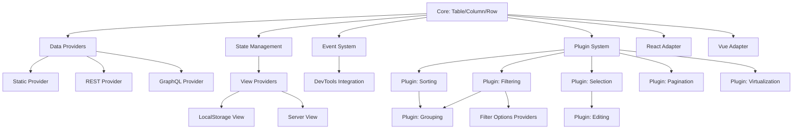
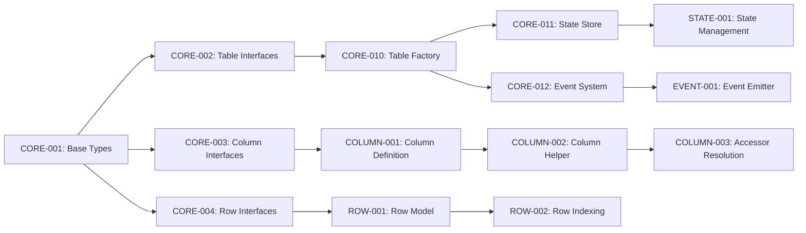
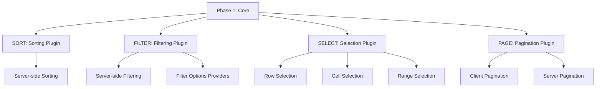
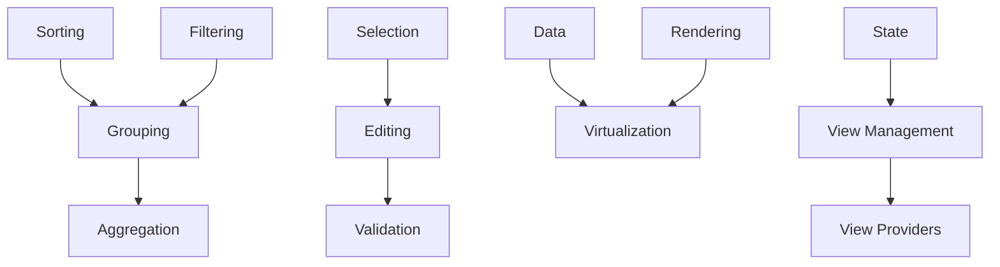

# GridKit - Dependency Graph

**Version:** 1.0.0  
**Last Updated:** 2024-02-01

---

## Overview

This document maps dependencies between all GridKit features to determine:
- **Development order** - What must be built first
- **Parallel opportunities** - What can be developed simultaneously
- **Critical path** - Minimum timeline for MVP
- **Release phases** - Logical grouping of features

---

## Module Dependency Graph



---

## Phase Breakdown

### Phase 1: Foundation (Weeks 1-3)
**Goal:** Core functionality that everything else depends on

**Critical Path:** CORE → DATA → BASIC RENDERING

### Phase 2: Essential Features (Weeks 4-6)
**Goal:** MVP-ready table with sorting, filtering, selection

**Critical Path:** SORTING → FILTERING → SELECTION → PAGINATION

### Phase 3: Advanced Features (Weeks 7-10)
**Goal:** Enterprise features (grouping, editing, virtualization)

**Critical Path:** GROUPING → EDITING → VIRTUALIZATION

### Phase 4: Ecosystem (Weeks 11-14)
**Goal:** Framework adapters, additional providers, DevTools

**Parallel:** All framework adapters can be built simultaneously

---

## Phase 1: Foundation (P0 - Critical)

### Core Module Dependencies



### Task Breakdown - Phase 1

#### Week 1: Core Types & Interfaces

| Task ID | Name | Dependencies | Est. Hours | AI Ready | Priority |
|---------|------|--------------|------------|----------|----------|
| CORE-001 | Base TypeScript Types | None | 8h | ✅ Yes | P0 |
| CORE-002 | Table Interfaces | CORE-001 | 8h | ✅ Yes | P0 |
| CORE-003 | Column Interfaces | CORE-001 | 8h | ✅ Yes | P0 |
| CORE-004 | Row Interfaces | CORE-001 | 8h | ✅ Yes | P0 |
| CORE-005 | State Interfaces | CORE-001 | 6h | ✅ Yes | P0 |
| CORE-006 | Event Interfaces | CORE-001 | 6h | ✅ Yes | P0 |

**Parallel Opportunity:** All can be done by different AI agents simultaneously

**Total:** 44h → With 3 AI agents: ~15h

---

#### Week 2: Core Implementation

| Task ID | Name | Dependencies | Est. Hours | AI Ready | Priority |
|---------|------|--------------|------------|----------|----------|
| CORE-010 | Table Factory | CORE-002 | 12h | ⚠️ Review | P0 |
| CORE-011 | State Store | CORE-005, CORE-010 | 16h | ⚠️ Review | P0 |
| CORE-012 | Event System | CORE-006, CORE-010 | 12h | ✅ Yes | P0 |
| CORE-013 | Lifecycle Hooks | CORE-010 | 8h | ✅ Yes | P0 |
| PLUGIN-001 | Plugin Registry | CORE-010 | 16h | ⚠️ Review | P0 |
| PLUGIN-002 | Plugin Lifecycle | PLUGIN-001 | 12h | ✅ Yes | P0 |

**Sequential:** CORE-010 must complete first

**Total:** 76h → With sequential deps: ~40h

---

#### Week 3: Column & Row Systems

| Task ID | Name | Dependencies | Est. Hours | AI Ready | Priority |
|---------|------|--------------|------------|----------|----------|
| COLUMN-001 | Column Definition | CORE-003 | 12h | ✅ Yes | P0 |
| COLUMN-002 | Column Helper | COLUMN-001 | 16h | ✅ Yes | P0 |
| COLUMN-003 | Accessor Resolution | COLUMN-002 | 16h | ✅ Yes | P0 |
| COLUMN-004 | Column Visibility | COLUMN-001, CORE-011 | 12h | ✅ Yes | P0 |
| COLUMN-005 | Column Ordering | COLUMN-001, CORE-011 | 12h | ✅ Yes | P0 |
| COLUMN-006 | Column Sizing | COLUMN-001, CORE-011 | 16h | ⚠️ Review | P0 |
| ROW-001 | Row Model | CORE-004 | 12h | ✅ Yes | P0 |
| ROW-002 | Row Indexing | ROW-001 | 12h | ✅ Yes | P0 |
| ROW-003 | Row Identity | ROW-001 | 8h | ✅ Yes | P0 |

**Parallel:** Column tasks and Row tasks can run in parallel

**Total:** 116h → With 2 parallel tracks: ~60h

---

#### Week 3: Data Providers (Parallel with Column/Row)

| Task ID | Name | Dependencies | Est. Hours | AI Ready | Priority |
|---------|------|--------------|------------|----------|----------|
| DATA-001 | DataProvider Interface | CORE-001 | 8h | ✅ Yes | P0 |
| DATA-002 | Static Provider | DATA-001, ROW-001 | 12h | ✅ Yes | P0 |
| DATA-003 | Data Loading Logic | DATA-001 | 12h | ✅ Yes | P0 |
| DATA-004 | Data Update Logic | DATA-002 | 10h | ✅ Yes | P0 |

**Total:** 42h → Sequential: ~42h

---

### Phase 1 Summary

**Total Estimated Hours:** 278h  
**With Parallelization (3 AI agents + 1 architect):** ~80-100h  
**Calendar Time:** 2-3 weeks

**Deliverables:**
- ✅ @gridkit/core package (basic functionality)
- ✅ Static data provider
- ✅ Column system (define, order, visibility, resize)
- ✅ Row model with indexing
- ✅ State management
- ✅ Event system
- ✅ Plugin registry (foundation)

**What's NOT included yet:**
- ❌ Sorting, filtering, grouping (Phase 2)
- ❌ Framework adapters (Phase 4)
- ❌ Advanced providers (REST, GraphQL - Phase 2-3)

---

## Phase 2: Essential Features (P0/P1)

### Feature Dependencies



### Task Breakdown - Phase 2

#### Week 4: Sorting

| Task ID | Name | Dependencies | Est. Hours | AI Ready | Priority |
|---------|------|--------------|------------|----------|----------|
| SORT-001 | Sorting State | CORE-011, PLUGIN-001 | 8h | ✅ Yes | P0 |
| SORT-002 | Comparator Functions | SORT-001 | 12h | ✅ Yes | P0 |
| SORT-003 | Client-side Sort | SORT-002, DATA-002 | 16h | ✅ Yes | P0 |
| SORT-004 | Multi-column Sort | SORT-003 | 12h | ✅ Yes | P1 |
| SORT-005 | Custom Comparators | SORT-003 | 8h | ✅ Yes | P1 |
| SORT-006 | Locale-aware Sort | SORT-003 | 12h | ✅ Yes | P2 |

**Total:** 68h

---

#### Week 4-5: Filtering (Parallel with Sorting)

| Task ID | Name | Dependencies | Est. Hours | AI Ready | Priority |
|---------|------|--------------|------------|----------|----------|
| FILTER-001 | Filtering State | CORE-011, PLUGIN-001 | 8h | ✅ Yes | P0 |
| FILTER-002 | Filter Predicates | FILTER-001 | 12h | ✅ Yes | P0 |
| FILTER-003 | Text Filters | FILTER-002 | 12h | ✅ Yes | P0 |
| FILTER-004 | Number Filters | FILTER-002 | 10h | ✅ Yes | P0 |
| FILTER-005 | Date Filters | FILTER-002 | 16h | ⚠️ Review | P1 |
| FILTER-006 | Boolean Filters | FILTER-002 | 6h | ✅ Yes | P1 |
| FILTER-007 | Multi-select Filter | FILTER-002 | 12h | ✅ Yes | P1 |
| FILTER-008 | Filter Combinations (AND/OR) | FILTER-003 | 16h | ⚠️ Review | P1 |
| FILTER-009 | Global Search | FILTER-001 | 12h | ✅ Yes | P1 |

**Total:** 104h

---

#### Week 5: Filter Options Providers

| Task ID | Name | Dependencies | Est. Hours | AI Ready | Priority |
|---------|------|--------------|------------|----------|----------|
| FILTOPT-001 | FilterOptionsProvider Interface | FILTER-001 | 8h | ✅ Yes | P1 |
| FILTOPT-002 | DataBased Provider | FILTOPT-001, DATA-002 | 12h | ✅ Yes | P1 |
| FILTOPT-003 | Static Provider | FILTOPT-001 | 8h | ✅ Yes | P1 |
| FILTOPT-004 | API Provider | FILTOPT-001 | 16h | ⚠️ Review | P2 |
| FILTOPT-005 | Cache Layer | FILTOPT-004 | 12h | ✅ Yes | P2 |

**Total:** 56h

---

#### Week 5-6: Selection

| Task ID | Name | Dependencies | Est. Hours | AI Ready | Priority |
|---------|------|--------------|------------|----------|----------|
| SELECT-001 | Selection State | CORE-011, PLUGIN-001 | 8h | ✅ Yes | P0 |
| SELECT-002 | Row Selection | SELECT-001, ROW-001 | 12h | ✅ Yes | P0 |
| SELECT-003 | Multiple Selection | SELECT-002 | 12h | ✅ Yes | P1 |
| SELECT-004 | Range Selection | SELECT-003 | 16h | ⚠️ Review | P1 |
| SELECT-005 | Cell Selection | SELECT-001, COLUMN-001 | 12h | ✅ Yes | P2 |
| SELECT-006 | Checkbox Selection | SELECT-002 | 8h | ✅ Yes | P1 |
| SELECT-007 | Keyboard Navigation | SELECT-001 | 20h | ⚠️ Review | P1 |
| SELECT-008 | Select All/None | SELECT-002 | 6h | ✅ Yes | P1 |

**Total:** 94h

---

#### Week 6: Pagination

| Task ID | Name | Dependencies | Est. Hours | AI Ready | Priority |
|---------|------|--------------|------------|----------|----------|
| PAGE-001 | Pagination State | CORE-011, PLUGIN-001 | 8h | ✅ Yes | P0 |
| PAGE-002 | Client Pagination | PAGE-001, DATA-002 | 12h | ✅ Yes | P0 |
| PAGE-003 | Page Size Control | PAGE-001 | 8h | ✅ Yes | P1 |
| PAGE-004 | Go to Page | PAGE-001 | 8h | ✅ Yes | P1 |
| PAGE-005 | Server Pagination | PAGE-001, DATA-010 | 16h | ⚠️ Review | P1 |

**Total:** 52h

---

#### Week 6: Server-side Operations

| Task ID | Name | Dependencies | Est. Hours | AI Ready | Priority |
|---------|------|--------------|------------|----------|----------|
| DATA-010 | REST DataProvider | DATA-001 | 16h | ⚠️ Review | P1 |
| DATA-011 | Query Serialization | DATA-010 | 12h | ✅ Yes | P1 |
| DATA-012 | Server Sorting Integration | SORT-001, DATA-010 | 12h | ✅ Yes | P1 |
| DATA-013 | Server Filtering Integration | FILTER-001, DATA-010 | 12h | ✅ Yes | P1 |
| DATA-014 | Server Pagination Integration | PAGE-001, DATA-010 | 10h | ✅ Yes | P1 |

**Total:** 62h

---

### Phase 2 Summary

**Total Estimated Hours:** 436h  
**With Parallelization (3-4 AI agents):** ~120-150h  
**Calendar Time:** 3-4 weeks

**Deliverables:**
- ✅ Client-side sorting (single & multi-column)
- ✅ Client-side filtering (all types)
- ✅ Filter options providers (data-based, static, API)
- ✅ Row/cell selection with keyboard navigation
- ✅ Client & server pagination
- ✅ REST data provider
- ✅ Server-side sorting/filtering/pagination

**Parallel Opportunities:**
- Sorting + Filtering (different agents)
- Selection + Pagination (different agents)
- Filter Options Providers + Server Operations

---

## Phase 3: Advanced Features (P1/P2)

### Feature Dependencies



### Task Breakdown - Phase 3

#### Week 7-8: Grouping & Aggregation

| Task ID | Name | Dependencies | Est. Hours | AI Ready | Priority |
|---------|------|--------------|------------|----------|----------|
| GROUP-001 | Grouping State | SORT-001, FILTER-001 | 12h | ⚠️ Review | P1 |
| GROUP-002 | Single-level Grouping | GROUP-001 | 20h | ⚠️ Review | P1 |
| GROUP-003 | Multi-level Grouping | GROUP-002 | 24h | ⚠️ Review | P2 |
| GROUP-004 | Expand/Collapse | GROUP-002 | 12h | ✅ Yes | P1 |
| GROUP-005 | Expand All/Collapse All | GROUP-004 | 8h | ✅ Yes | P1 |
| AGG-001 | Aggregation Functions | GROUP-001 | 16h | ✅ Yes | P1 |
| AGG-002 | Sum/Avg/Count/Min/Max | AGG-001 | 12h | ✅ Yes | P1 |
| AGG-003 | Custom Aggregations | AGG-002 | 12h | ✅ Yes | P2 |
| AGG-004 | Footer Totals | AGG-001 | 10h | ✅ Yes | P1 |

**Total:** 126h

---

#### Week 8-9: Editing

| Task ID | Name | Dependencies | Est. Hours | AI Ready | Priority |
|---------|------|--------------|------------|----------|----------|
| EDIT-001 | Editing State | SELECT-001, PLUGIN-001 | 12h | ⚠️ Review | P1 |
| EDIT-002 | Inline Edit Mode | EDIT-001 | 16h | ⚠️ Review | P1 |
| EDIT-003 | Text Editor | EDIT-002 | 8h | ✅ Yes | P1 |
| EDIT-004 | Number Editor | EDIT-002 | 8h | ✅ Yes | P1 |
| EDIT-005 | Date Editor | EDIT-002 | 16h | ⚠️ Review | P1 |
| EDIT-006 | Select Editor | EDIT-002 | 12h | ✅ Yes | P1 |
| EDIT-007 | Checkbox Editor | EDIT-002 | 6h | ✅ Yes | P1 |
| VALID-001 | Validation Interface | EDIT-001 | 8h | ✅ Yes | P1 |
| VALID-002 | Sync Validation | VALID-001 | 12h | ✅ Yes | P1 |
| VALID-003 | Async Validation | VALID-002 | 16h | ⚠️ Review | P2 |
| VALID-004 | Error Display | VALID-001 | 10h | ✅ Yes | P1 |
| EDIT-010 | Dirty State Tracking | EDIT-001 | 12h | ✅ Yes | P2 |
| EDIT-011 | Save/Cancel | EDIT-001 | 10h | ✅ Yes | P1 |

**Total:** 146h

---

#### Week 9-10: Virtualization

| Task ID | Name | Dependencies | Est. Hours | AI Ready | Priority |
|---------|------|--------------|------------|----------|----------|
| VIRT-001 | Virtual Scroll Core | ROW-001, RENDER-001 | 32h | ⚠️ Critical | P0 |
| VIRT-002 | Dynamic Row Heights | VIRT-001 | 24h | ⚠️ Critical | P1 |
| VIRT-003 | Overscan Strategy | VIRT-001 | 12h | ✅ Yes | P1 |
| VIRT-004 | Scroll Sync | VIRT-001 | 16h | ⚠️ Review | P1 |
| VIRT-005 | Column Virtualization | VIRT-001, COLUMN-001 | 24h | ⚠️ Review | P2 |
| VIRT-006 | Smooth Scrolling | VIRT-001 | 16h | ⚠️ Review | P1 |

**Total:** 124h

---

#### Week 10: View Management

| Task ID | Name | Dependencies | Est. Hours | AI Ready | Priority |
|---------|------|--------------|------------|----------|----------|
| VIEW-001 | View Definition | CORE-011 | 12h | ✅ Yes | P1 |
| VIEW-002 | View Serialization | VIEW-001 | 12h | ✅ Yes | P1 |
| VIEW-003 | Save View | VIEW-001 | 10h | ✅ Yes | P1 |
| VIEW-004 | Load View | VIEW-001 | 10h | ✅ Yes | P1 |
| VIEW-005 | Delete View | VIEW-001 | 6h | ✅ Yes | P1 |
| VIEW-006 | View List Management | VIEW-001 | 8h | ✅ Yes | P1 |
| VIEWP-001 | ViewProvider Interface | VIEW-001 | 8h | ✅ Yes | P1 |
| VIEWP-002 | LocalStorage Provider | VIEWP-001 | 12h | ✅ Yes | P1 |
| VIEWP-003 | SessionStorage Provider | VIEWP-001 | 8h | ✅ Yes | P2 |
| VIEWP-004 | Server Provider | VIEWP-001 | 16h | ⚠️ Review | P2 |

**Total:** 102h

---

#### Week 10: Export

| Task ID | Name | Dependencies | Est. Hours | AI Ready | Priority |
|---------|------|--------------|------------|----------|----------|
| EXPORT-001 | Export Interface | DATA-002 | 8h | ✅ Yes | P1 |
| EXPORT-002 | CSV Export | EXPORT-001 | 12h | ✅ Yes | P1 |
| EXPORT-003 | Excel Export (Basic) | EXPORT-001 | 24h | ⚠️ Library | P1 |
| EXPORT-004 | Excel Formatting | EXPORT-003 | 16h | ⚠️ Library | P2 |
| EXPORT-005 | Export Selected Rows | EXPORT-001, SELECT-001 | 8h | ✅ Yes | P1 |
| EXPORT-006 | Export with Filters | EXPORT-001, FILTER-001 | 10h | ✅ Yes | P1 |

**Total:** 78h

---

### Phase 3 Summary

**Total Estimated Hours:** 576h  
**With Parallelization:** ~180-200h  
**Calendar Time:** 4-5 weeks

**Deliverables:**
- ✅ Grouping (single & multi-level) with aggregations
- ✅ Inline editing with validation
- ✅ Virtual scrolling (100K+ rows support)
- ✅ View management with persistence
- ✅ Export to CSV/Excel

**Critical Items (Need careful review):**
- ⚠️ Virtualization (performance-critical)
- ⚠️ Multi-level grouping (complex state)
- ⚠️ Async validation (race conditions)

---

## Phase 4: Ecosystem & Polish (P2/P3)

### Task Breakdown - Phase 4

#### Week 11-12: Framework Adapters

**All can be developed in PARALLEL**

| Task ID | Name | Dependencies | Est. Hours | AI Ready | Priority |
|---------|------|--------------|------------|----------|----------|
| REACT-001 | React Hook (useTable) | All Phase 1-3 | 24h | ⚠️ Review | P0 |
| REACT-002 | React Components | REACT-001 | 32h | ⚠️ Review | P1 |
| REACT-003 | React Context | REACT-001 | 16h | ✅ Yes | P1 |
| REACT-004 | React Examples | REACT-002 | 16h | ✅ Yes | P1 |
| VUE-001 | Vue Composition API | All Phase 1-3 | 24h | ⚠️ Review | P2 |
| VUE-002 | Vue Components | VUE-001 | 32h | ⚠️ Review | P2 |
| ANGULAR-001 | Angular Module | All Phase 1-3 | 32h | ⚠️ Review | P3 |
| SVELTE-001 | Svelte Components | All Phase 1-3 | 24h | ⚠️ Review | P3 |

**Total:** 200h (but parallel, so ~50-60h calendar time with 4 agents)

---

#### Week 12-13: Additional Providers

| Task ID | Name | Dependencies | Est. Hours | AI Ready | Priority |
|---------|------|--------------|------------|----------|----------|
| DATA-020 | GraphQL Provider | DATA-001 | 24h | ⚠️ Review | P2 |
| DATA-021 | WebSocket Provider | DATA-001 | 24h | ⚠️ Review | P2 |
| DATA-022 | IndexedDB Provider | DATA-001 | 32h | ⚠️ Review | P3 |
| VIEWP-010 | IndexedDB View Provider | VIEWP-001 | 16h | ⚠️ Review | P3 |

**Total:** 96h

---

#### Week 13-14: DevTools

| Task ID | Name | Dependencies | Est. Hours | AI Ready | Priority |
|---------|------|--------------|------------|----------|----------|
| DEBUG-001 | Debug Mode Implementation | CORE-012 | 16h | ⚠️ Review | P1 |
| DEBUG-002 | Redux DevTools Connector | DEBUG-001 | 20h | ⚠️ Review | P1 |
| DEBUG-003 | Performance Monitor | CORE-011 | 24h | ⚠️ Review | P1 |
| DEBUG-004 | Memory Profiler | CORE-011 | 24h | ⚠️ Review | P2 |
| DEVTOOLS-001 | DevTools Plugin | DEBUG-001 | 32h | ⚠️ Review | P2 |
| DEVTOOLS-002 | Browser Extension | DEVTOOLS-001 | 40h | ⚠️ Review | P3 |

**Total:** 156h

---

#### Week 14: Advanced Features

| Task ID | Name | Dependencies | Est. Hours | AI Ready | Priority |
|---------|------|--------------|------------|----------|----------|
| COLUMN-020 | Column Groups | COLUMN-001 | 24h | ⚠️ Review | P2 |
| COLUMN-021 | Freeze Columns | COLUMN-001, VIRT-001 | 32h | ⚠️ Review | P2 |
| TREE-001 | Tree Data Support | ROW-001, GROUP-001 | 32h | ⚠️ Review | P2 |
| I18N-001 | i18n Plugin | PLUGIN-001 | 24h | ⚠️ Review | P2 |
| A11Y-001 | Accessibility Audit | All | 32h | ⚠️ Review | P1 |

**Total:** 144h

---

### Phase 4 Summary

**Total Estimated Hours:** 596h  
**With Parallelization:** ~150-180h  
**Calendar Time:** 4-5 weeks

**Deliverables:**
- ✅ React adapter (hooks + components)
- ✅ Vue adapter
- ✅ Additional data providers (GraphQL, WebSocket, IndexedDB)
- ✅ Redux DevTools integration
- ✅ Performance monitoring
- ✅ Advanced features (tree data, column groups, freeze)

---

## Critical Path Analysis

### Absolute Minimum for MVP (P0 only)

```
CORE-001 → CORE-002/003/004 → CORE-010 → COLUMN-001 → DATA-002 → 
SORT-003 → FILTER-003 → SELECT-002 → PAGE-002 → VIRT-001 → REACT-001

Estimated: ~200h of sequential work
With 2-3 AI agents: ~8-10 weeks calendar time
```

### Recommended MVP (P0 + essential P1)

```
All Phase 1 + Phase 2 (Sorting, Filtering, Selection, Pagination)

Estimated: ~714h
With 3-4 AI agents + 1 architect: ~12-14 weeks
```

### Full v1.0 Release

```
All Phase 1-4

Estimated: ~1,886h
With 4-5 AI agents + 1 architect: ~20-24 weeks (5-6 months)
```

---

## Parallel Development Opportunities

### Week 1 (Foundation - 3 agents)
- **Agent 1:** CORE-001, CORE-002
- **Agent 2:** CORE-003, CORE-004
- **Agent 3:** CORE-005, CORE-006

### Week 2-3 (Core + Data - 3 agents)
- **Agent 1:** CORE-010, CORE-011, CORE-012 (sequential)
- **Agent 2:** COLUMN-001, COLUMN-002, COLUMN-003 (sequential)
- **Agent 3:** DATA-001, DATA-002, DATA-003 (sequential)

### Week 4-6 (Features - 4 agents)
- **Agent 1:** Sorting (SORT-001 → SORT-006)
- **Agent 2:** Filtering (FILTER-001 → FILTER-009)
- **Agent 3:** Selection (SELECT-001 → SELECT-008)
- **Agent 4:** Pagination (PAGE-001 → PAGE-005)

### Week 7-10 (Advanced - 3 agents)
- **Agent 1:** Grouping + Aggregation
- **Agent 2:** Editing + Validation
- **Agent 3:** Virtualization (critical - needs review)

### Week 11-14 (Ecosystem - 4 agents)
- **Agent 1:** React adapter
- **Agent 2:** Vue adapter
- **Agent 3:** Additional providers
- **Agent 4:** DevTools

---

## Risk Analysis

### High-Risk Items (Need architect involvement)

| Task | Risk | Mitigation |
|------|------|------------|
| VIRT-001 | Performance critical | Architect implements core, AI extends |
| GROUP-002 | Complex state | Detailed spec, multiple reviews |
| EDIT-001 | State complexity | Prototype first, then AI |
| DEBUG-002 | Integration complexity | Use existing libraries where possible |
| REACT-001 | Framework coupling | Clear separation of concerns |

### Dependencies with External Libraries

| Task | External Dependency | Alternative |
|------|-------------------|-------------|
| EXPORT-003 | ExcelJS / xlsx | Implement basic CSV, Excel as plugin |
| EDIT-005 | Date picker library | Use native input[type=date] initially |
| I18N-001 | i18n library | Own minimal implementation |

---

## Version Planning

### v0.1.0-alpha (Week 4)
- Core + Column + Row + Static Data
- No features yet
- For internal testing only

### v0.5.0-beta (Week 8)
- All Phase 1 + Phase 2
- Sorting, Filtering, Selection, Pagination
- Client-side only
- React adapter (basic)
- Beta testing with early adopters

### v1.0.0 (Week 14)
- All Phase 1-3
- Grouping, Editing, Virtualization
- Server-side operations
- View management
- React + Vue adapters
- Production-ready

### v1.1.0+ (Week 18+)
- Advanced features
- Additional providers
- Full DevTools
- Angular/Svelte adapters
- Advanced i18n

---

## Task Assignment Strategy

### AI-Ready Tasks (Can assign immediately)
- Type definitions
- Simple CRUD operations
- Basic UI components
- Unit tests
- Documentation

**~60% of tasks**

### AI with Review (Need human review)
- Complex state management
- Performance-critical code
- Integration logic
- Advanced TypeScript generics

**~30% of tasks**

### Human Required (Architect only)
- Architectural decisions
- Plugin system core
- Virtualization core
- Critical path items

**~10% of tasks**

---

## Next Steps

1. ✅ Architecture approved (ARCHITECTURE.md)
2. ✅ Dependencies mapped (this document)
3. 🔄 **Create FEATURE_MATRIX.md** (detailed prioritization)
4. 🔄 **Break down Phase 1 into task files**
5. 🔄 **Create API specs for core modules**
6. 🔄 **Start development with Phase 1**

---

## Appendix: Full Task Count

| Phase | P0 Tasks | P1 Tasks | P2 Tasks | P3 Tasks | Total |
|-------|----------|----------|----------|----------|-------|
| Phase 1 | 25 | 5 | 3 | 0 | 33 |
| Phase 2 | 15 | 30 | 10 | 0 | 55 |
| Phase 3 | 5 | 35 | 20 | 0 | 60 |
| Phase 4 | 5 | 15 | 25 | 15 | 60 |
| **Total** | **50** | **85** | **58** | **15** | **208** |

**Average task size:** ~9 hours  
**Total estimated:** ~1,900 hours  
**With 4 AI agents:** ~500 hours human oversight  
**Calendar time:** 20-24 weeks

