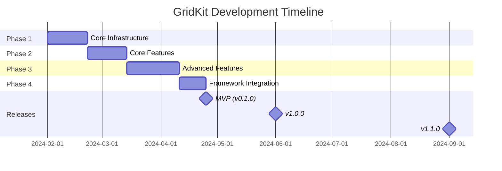

# GridKit - Product Roadmap

**Last Updated:** January 2024  
**Status:** Planning Phase  
**Current Version:** 0.0.0  
**Target v1.0:** Q3 2024

---

## Executive Summary

GridKit is an enterprise-grade, framework-agnostic table library optimized for handling large datasets (100k+ rows) with advanced features like virtualization, real-time updates, and extensible plugin architecture.

**Key Differentiators:**
- 🚀 Virtual scrolling for 100k+ rows
- 🎯 Framework-agnostic core
- 🔌 Powerful plugin system
- 📦 Tree-shakeable (~15kb core gzipped)
- ⚡ Performance-first design
- 🎨 Fully customizable

---

## Release Milestones

### 🎯 MVP (v0.1.0) - Target: Week 12 (March 2024)

**Goal:** Functional table with core features for production use

**Scope (P0 + P1 features):**
- ✅ Core table infrastructure
- ✅ Static and REST data providers
- ✅ Client-side sorting and filtering
- ✅ Virtual scrolling (100k+ rows)
- ✅ Column management (resize, reorder, hide/show)
- ✅ Row selection (single/multiple)
- ✅ Pagination (client + server)
- ✅ Layout persistence (localStorage)
- ✅ Basic editing
- ✅ CSV/Excel export
- ✅ React adapter

**Success Criteria:**
- [ ] All P0 features implemented and tested
- [ ] 90%+ test coverage
- [ ] Performance benchmarks met (see below)
- [ ] Documentation complete
- [ ] 5+ example applications
- [ ] Zero critical bugs

**Performance Targets (MVP):**
| Metric | Target | Max Acceptable |
|--------|--------|----------------|
| Initial render (1k rows) | < 50ms | < 100ms |
| Virtual scroll (100k rows) | < 100ms | < 200ms |
| Sort 10k rows | < 100ms | < 200ms |
| Filter 10k rows | < 50ms | < 100ms |
| Core bundle size | < 15kb gzipped | < 20kb |

---

### 🚀 v1.0.0 - Target: Week 26 (June 2024)

**Goal:** Production-ready with all essential features

**Additional Features (P2):**
- ✅ Grouping and aggregation
- ✅ Advanced filtering (filter builder)
- ✅ GraphQL and WebSocket providers
- ✅ Advanced editing (validation, async)
- ✅ Tree data support
- ✅ Master-detail views
- ✅ PDF export
- ✅ Server-side operations
- ✅ Column freezing
- ✅ Internationalization (i18n)
- ✅ Accessibility (WCAG 2.1 AA)
- ✅ Vue adapter
- ✅ Dark theme

**Success Criteria:**
- [ ] All P0-P2 features implemented
- [ ] 95%+ test coverage
- [ ] Performance optimized
- [ ] Full API documentation
- [ ] Migration guides
- [ ] Production case studies (3+)
- [ ] Community feedback incorporated

---

### 🌟 v1.1.0+ - Target: Q3-Q4 2024

**Goal:** Enterprise features and advanced capabilities

**Features (P3):**
- ✅ Real-time collaborative editing
- ✅ Advanced security (row/column/cell level)
- ✅ Audit logging
- ✅ IndexedDB provider (offline-first)
- ✅ Advanced virtualization (variable heights)
- ✅ Pivot table mode
- ✅ Custom plugin marketplace
- ✅ Angular adapter
- ✅ Advanced theming
- ✅ Performance monitoring
- ✅ A11y enhancements (WCAG AAA)

---

## Development Phases

### 📋 Phase 1: Foundation (Weeks 1-3)

**Focus:** Core infrastructure and type system

**Deliverables:**
- Core types and interfaces
- Table instance management
- Column system (definition, helpers, accessors)
- Row model
- State management
- Event system
- Static data provider

**Key Tasks:**
- CORE-001 to CORE-013: Core types and table
- COLUMN-001 to COLUMN-005: Column system
- ROW-001 to ROW-004: Row model
- DATA-001 to DATA-004: Data providers

**Team Allocation:**
- 3 AI agents (parallel tasks)
- 1 human architect (reviews, architecture decisions)

**Milestone:** Working table rendering static data

---

### ⚙️ Phase 2: Core Features (Weeks 4-6)

**Focus:** Essential table functionality

**Deliverables:**
- Client-side sorting (single + multi-column)
- Client-side filtering (text, number, date)
- Pagination (client + server)
- Row selection (single/multiple/range)
- Virtual scrolling
- Column operations (resize, reorder, hide/show)
- REST data provider

**Key Tasks:**
- SORT-001 to SORT-004: Sorting system
- FILTER-001 to FILTER-005: Filtering system
- PAGE-001 to PAGE-003: Pagination
- SELECT-001 to SELECT-004: Selection
- VIRT-001 to VIRT-004: Virtualization
- DATA-010 to DATA-014: REST provider

**Team Allocation:**
- 3 AI agents (parallel modules)
- 1 human architect (performance optimization, reviews)

**Milestone:** Functional table with sorting, filtering, pagination

---

### 🎨 Phase 3: Advanced Features (Weeks 7-10)

**Focus:** Enhanced functionality and user experience

**Deliverables:**
- Grouping and aggregation
- Advanced filtering (filter builder, presets)
- Basic editing (inline, validation)
- Layout system (save/load, presets)
- Export (CSV, Excel, PDF)
- Server-side operations
- Column freezing
- GraphQL provider

**Key Tasks:**
- GROUP-001 to GROUP-004: Grouping
- FILTER-010 to FILTER-015: Advanced filtering
- EDIT-001 to EDIT-008: Editing system
- LAYOUT-001 to LAYOUT-010: Layout management
- EXPORT-001 to EXPORT-004: Export
- DATA-020 to DATA-025: Server operations

**Team Allocation:**
- 3-4 AI agents
- 1 human architect
- 1 QA engineer (testing, performance)

**Milestone:** Feature-complete table library

---

### 🔌 Phase 4: Framework Integration (Weeks 11-12)

**Focus:** Framework adapters and developer experience

**Deliverables:**
- React adapter (hooks, components, context)
- Documentation (guides, API reference, examples)
- Storybook demos
- Example applications
- Migration guides
- Performance benchmarks

**Key Tasks:**
- REACT-001 to REACT-010: React integration
- DOCS-001 to DOCS-020: Documentation
- EXAMPLES-001 to EXAMPLES-010: Examples

**Team Allocation:**
- 2 AI agents (React adapter, examples)
- 1 human (documentation, polish)
- 1 technical writer

**Milestone:** MVP Release (v0.1.0)

---

## Feature Rollout Timeline

---

## Resource Allocation

### Team Composition

**Phase 1-2 (Weeks 1-6):**
- 1 Senior Architect (40h/week)
- 3 AI Agents (continuous)
- 1 QA Engineer (20h/week, from week 3)

**Phase 3-4 (Weeks 7-12):**
- 1 Senior Architect (40h/week)
- 3-4 AI Agents (continuous)
- 1 QA Engineer (40h/week)
- 1 Technical Writer (20h/week, from week 10)

**Post-MVP:**
- 1 Senior Architect (20h/week)
- 2 AI Agents (continuous)
- 1 QA Engineer (20h/week)
- 1 Technical Writer (10h/week)
- 1 Community Manager (10h/week)

---

## Risk Management

### High-Priority Risks

| Risk | Impact | Probability | Mitigation |
|------|--------|-------------|------------|
| Performance targets not met for 100k rows | High | Medium | Early prototyping of virtualization, continuous benchmarking |
| Framework integration complexity | Medium | High | Start React adapter in Phase 2, iterate based on feedback |
| Scope creep (500+ features) | High | High | Strict prioritization (P0-P3), MVP-first approach |
| AI code quality issues | Medium | Medium | Mandatory human review for critical code, comprehensive testing |
| Breaking changes during development | Medium | Medium | Lock API design early, versioning strategy from day 1 |

### Medium-Priority Risks

| Risk | Impact | Probability | Mitigation |
|------|--------|-------------|------------|
| Browser compatibility issues | Medium | Low | Target modern browsers (2 years), polyfills for critical features |
| Accessibility compliance | Medium | Medium | A11y reviews from Phase 2, automated testing |
| Documentation gaps | Medium | Medium | Docs alongside code, technical writer from week 10 |
| Plugin system complexity | High | Low | Prototype early, validate with community |

---

## Success Metrics

### Adoption Metrics (6 months post-v1.0)

- [ ] 1,000+ GitHub stars
- [ ] 50+ production deployments
- [ ] 10,000+ npm downloads/month
- [ ] 5+ community plugins
- [ ] 90%+ positive feedback

### Quality Metrics (Continuous)

- [ ] 95%+ test coverage
- [ ] Zero critical bugs in production
- [ ] < 5 high-priority bugs per release
- [ ] 100% documented public API
- [ ] All performance benchmarks met

### Community Metrics (12 months)

- [ ] 20+ contributors
- [ ] 100+ closed issues
- [ ] Active Discord community (500+ members)
- [ ] Monthly releases
- [ ] Case studies from 10+ companies

---

## Post-v1.0 Vision

### v2.0 (2025)

**Major Enhancements:**
- WASM-powered data processing
- Native mobile adapters (React Native, Flutter)
- AI-powered features (smart filtering, auto-grouping)
- Advanced collaboration features
- Cloud-native integrations

### Ecosystem Growth

- Plugin marketplace
- Premium support tier
- Enterprise licensing
- Training and certification
- Conference sponsorships

---

## Dependencies and Assumptions

### Dependencies

**External:**
- TypeScript 5.0+ stable
- Modern browsers (ES2020+)
- React 18+ for adapter
- Node.js 16+ for tooling

**Internal:**
- Team availability as planned
- AI agents perform at 60%+ efficiency
- Timely reviews and feedback

### Assumptions

- No major blocking bugs in dependencies
- Community feedback is constructive
- Performance targets are achievable
- Scope remains stable (P0-P3 classification)

---

## Communication Plan

### Internal

- **Daily:** AI agent progress updates (automated)
- **Weekly:** Team sync (architecture, blockers, priorities)
- **Bi-weekly:** Demo of completed features
- **Monthly:** Roadmap review and adjustments

### External

- **Monthly:** Blog post on progress
- **Quarterly:** Community survey
- **Pre-release:** Beta program (50+ users)
- **Post-release:** Release notes, migration guides

---

## Change Management

### How to Propose Changes

1. Create GitHub issue with `roadmap` label
2. Discuss in weekly team sync
3. Document decision in `/docs/decisions/`
4. Update roadmap with rationale

### Approval Process

- **Minor changes** (timeline shifts < 1 week): Team lead
- **Major changes** (scope/priority changes): Team consensus
- **Critical changes** (architecture shifts): Stakeholder review

---

## Next Steps (Immediate)

1. ✅ **Complete Phase 0-1 setup** (Week 1)
   - Finalize ARCHITECTURE.md
   - Create AI_GUIDELINES.md
   - Set up project infrastructure

2. ⏭️ **Begin Phase 1 development** (Week 2)
   - Assign tasks to AI agents
   - Start parallel development (CORE, COLUMN, ROW modules)
   - Daily reviews and iterations

3. ⏭️ **Establish CI/CD** (Week 2)
   - Automated testing
   - Performance benchmarking
   - Code quality checks

4. ⏭️ **Community building** (Week 3+)
   - GitHub repository setup
   - Documentation site
   - Discord community

---

## Conclusion

GridKit aims to become the **de facto standard for enterprise-grade data tables** by combining:
- **Performance:** Handle 100k+ rows effortlessly
- **Flexibility:** Framework-agnostic with powerful adapters
- **Extensibility:** Plugin system for unlimited customization
- **Developer Experience:** Type-safe, well-documented, easy to use

With a **12-week path to MVP** and **26-week path to v1.0**, we're positioned to deliver a production-ready library that meets the needs of modern web applications.

---

**Document Version:** 1.0  
**Author:** GridKit Team  
**Approval:** Pending  
**Next Review:** Week 4 (February 2024)
