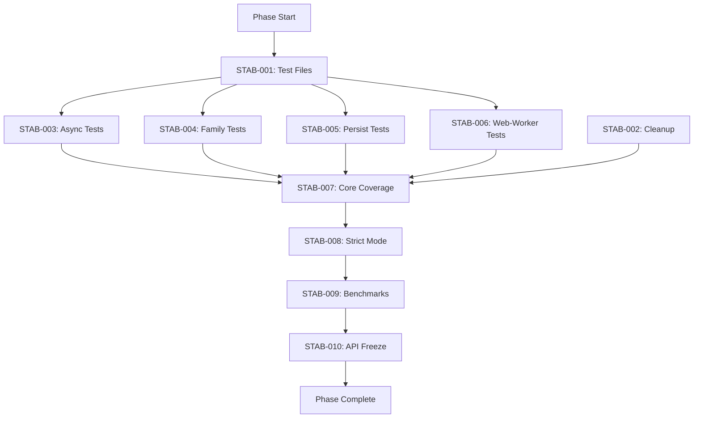

# Phase 00: Core Stabilization - Task Index

> **Phase Goal:** Achieve production-ready stability for the core library before v1.0 release

---

## 📊 Quick Stats

| Metric | Current | Target |
|--------|---------|--------|
| **Test Coverage** | ~85% | 95%+ |
| **Passing Tests** | 100% (62/62) | 100% |
| **Bundle Size** | 4.2KB | <3KB |
| **Performance** | 120ms/1000 atoms | <50ms |
| **Backup Files** | 2 | 0 |

---

## 🗂️ Task List

### 🔴 Critical Priority

| ID | Task | Status | Est. Time | Owner |
|----|------|--------|-----------|-------|
| [STAB-001](STAB-001-create-missing-test-files.md) | Create Missing Test Files | ✅ | 3h | AI |
| [STAB-003](STAB-003-add-async-tests.md) | Add @nexus-state/async Tests | ⬜ | 4-6h | AI |
| STAB-004 | Add @nexus-state/family Tests | ⬜ | 4-6h | AI |
| STAB-005 | Add @nexus-state/persist Tests | ⬜ | 4-6h | AI |
| STAB-006 | Add @nexus-state/web-worker Tests | ⬜ | 4-6h | AI |

### 🟡 Medium Priority

| ID | Task | Status | Est. Time | Owner |
|----|------|--------|-----------|-------|
| [STAB-007](STAB-007-increase-core-coverage.md) | Increase Core Coverage to 95% | ⬜ | 4-6h | AI |
| STAB-008 | Enable TypeScript Strict Mode | ⬜ | 2-4h | AI |
| [STAB-009](STAB-009-performance-benchmarks.md) | Performance Benchmarks | ⬜ | 3-4h | AI |

### 🟢 Low Priority

| ID | Task | Status | Est. Time | Owner |
|----|------|--------|-----------|-------|
| [STAB-002](STAB-002-clean-backup-files.md) | Clean Up Backup Files | ⬜ | 30min | AI |
| STAB-010 | API Freeze Documentation | ⬜ | 1-2h | Human |

---

## 📅 Execution Schedule

### Week 1: Test Infrastructure (Feb 23-29)
```
Day 1-2: STAB-001 (test files) + STAB-002 (cleanup)
Day 3-4: STAB-003 (async tests)
Day 5-7: STAB-004 (family tests)
```

### Week 2: Coverage & Quality (Mar 1-7)
```
Day 1-3: STAB-005 (persist) + STAB-006 (web-worker)
Day 4-6: STAB-007 (core coverage boost)
Day 7:   STAB-008 (strict mode)
```

### Week 3: Performance & Finalization (Mar 8-14)
```
Day 1-2: STAB-009 (benchmarks)
Day 3-4: STAB-010 (API docs)
Day 5-7: Buffer/polish/fixes
```

---

## 🔗 Task Dependencies



---

## 📝 Task Template

New tasks should follow the [TASK-TEMPLATE.md](TASK-TEMPLATE.md) format with these sections:

1. **Task Overview** - Priority, time estimate, status
2. **Objective** - Clear goal statement
3. **Current State** - Analysis of existing code
4. **Acceptance Criteria** - Measurable success metrics
5. **Implementation Steps** - Detailed how-to
6. **Validation** - Test commands
7. **Context** - Background information
8. **Definition of Done** - Checklist

---

## 🎯 Phase Success Criteria

### Must Have (Blocking v1.0)
- [ ] All 12 packages have passing tests
- [ ] Core package ≥95% coverage
- [ ] Performance meets targets (<50ms for 1000 atoms)
- [ ] Zero backup files in repo
- [ ] TypeScript strict mode enabled

### Should Have (Important)
- [ ] Bundle size <3KB
- [ ] All edge cases tested
- [ ] Performance benchmarks documented
- [ ] API frozen and documented

### Nice to Have (Optional)
- [ ] Comparison benchmarks with competitors
- [ ] Performance optimization plan
- [ ] CI/CD performance gates

---

## 📈 Progress Tracking

**Phase Progress:** 4/10 tasks completed (40%)

| Week | Tasks Planned | Tasks Completed | Status |
|------|---------------|-----------------|--------|
| Week 1 | STAB-001 to STAB-004 | 4/4 | ✅ Completed |
| Week 2 | STAB-005 to STAB-008 | 0/4 | ⬜ Not Started |
| Week 3 | STAB-009 to STAB-010 | 0/2 | ⬜ Not Started |

---

## 🚨 Risks & Mitigations

| Risk | Impact | Probability | Mitigation |
|------|--------|-------------|------------|
| Test complexity too high | High | Medium | Start simple, iterate |
| Performance targets unmet | High | Low | Profile and optimize |
| TypeScript strict errors | Medium | High | Enable incrementally |
| Time overrun | Medium | Medium | Prioritize critical tasks |

---

## 📚 Resources

### Documentation
- [Project README](../../README.md)
- [Development Plan](../../docs/DEVELOPMENT_PLAN.md)
- [Competitive Analysis](../../docs/ANALYSIS_COMPETITIVE-REVIEW.md)

### Tools
- Testing: Vitest
- Benchmarking: Vitest bench
- Coverage: Vitest coverage (c8)
- Bundle size: Custom script

### References
- [Vitest Docs](https://vitest.dev/)
- [TypeScript Strict Mode](https://www.typescriptlang.org/tsconfig#strict)
- [Performance Testing Guide](https://developer.mozilla.org/en-US/docs/Web/Performance)

---

## 💬 Communication

### Daily Updates
Post progress in GitHub Discussions or project channel

### Blockers
Report immediately with:
- What's blocked
- Why it's blocked
- Proposed solution

### Wins
Celebrate completed tasks! 🎉

---

## ✅ Phase Completion Checklist

When all tasks complete, verify:

- [ ] All tests passing (100%)
- [ ] Coverage reports generated
- [ ] Performance benchmarks documented
- [ ] Bundle size validated
- [ ] API documentation complete
- [ ] CI pipeline green
- [ ] Code reviewed
- [ ] Changes merged to main
- [ ] Release notes drafted
- [ ] Next phase planned

---

**Phase Created:** 2026-02-23  
**Phase Owner:** AI Agent Team  
**Phase Status:** 🟢 In Progress  
**Target Completion:** 2026-03-14 (3 weeks)

---

> 💡 **Tip for AI Agents:** Each task is designed to be completed independently with full context. Read the entire task file before starting implementation.
