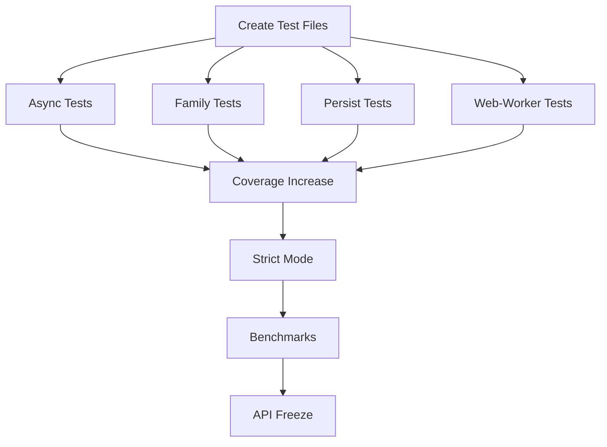

# Phase 00: Core Stabilization (Week 1-3)

## 🎯 Phase Overview

**Goal:** Stabilize the core package and ensure all packages have proper test coverage before moving to production.

**Duration:** 2-3 weeks  
**Priority:** 🔴 CRITICAL  
**Status:** 🟡 In Progress

---

## 📊 Success Criteria

- [ ] All 12 packages have passing tests (currently 6/12 failing)
- [ ] Core package has 95%+ test coverage
- [ ] All backup/temporary files removed
- [ ] Public API frozen (no breaking changes)
- [ ] Performance benchmarks established
- [ ] TypeScript strict mode enabled

---

## 📋 Task Breakdown

| Task ID | Title | Priority | Estimated Time | Status |
|---------|-------|----------|----------------|--------|
| STAB-001 | Create Missing Test Files for Empty Packages | 🔴 High | 2-3 hours | ⬜ Not Started |
| STAB-002 | Clean Up Backup Files | 🟢 Low | 30 min | ⬜ Not Started |
| STAB-003 | Add Unit Tests for @nexus-state/async | 🔴 High | 4-6 hours | ⬜ Not Started |
| STAB-004 | Add Unit Tests for @nexus-state/family | 🔴 High | 4-6 hours | ⬜ Not Started |
| STAB-005 | Add Unit Tests for @nexus-state/persist | 🔴 High | 4-6 hours | ⬜ Not Started |
| STAB-006 | Add Unit Tests for @nexus-state/web-worker | 🔴 High | 4-6 hours | ⬜ Not Started |
| STAB-007 | Increase Core Package Test Coverage | 🟡 Medium | 4-6 hours | ⬜ Not Started |
| STAB-008 | Enable TypeScript Strict Mode | 🟡 Medium | 2-4 hours | ⬜ Not Started |
| STAB-009 | Establish Performance Benchmarks | 🟡 Medium | 3-4 hours | ⬜ Not Started |
| STAB-010 | API Freeze Documentation | 🟢 Low | 1-2 hours | ⬜ Not Started |

---

## 🔗 Dependencies

---

## 📈 Progress Tracking

**Overall Progress:** 1/10 tasks completed (10%)

### Completed Tasks
- [x] **STAB-002**: Clean Up Backup Files ✅ (2026-02-23)
  - Removed all `*.backup.*` files from codebase
  - Removed all `*.bak` and timestamped backup files
  - Updated `.gitignore` to prevent future backup files
  - Added deprecation notice to remaining backup references

### Week 1 Goals
- [ ] STAB-001: Create test infrastructure
- [ ] STAB-003: Async package tests
- [ ] STAB-004: Family package tests

### Week 2 Goals
- [ ] STAB-005: Persist package tests
- [ ] STAB-006: Web-worker package tests
- [ ] STAB-007: Core coverage boost

### Week 3 Goals
- [ ] STAB-008: TypeScript strict mode
- [ ] STAB-009: Performance benchmarks
- [ ] STAB-010: API documentation

---

## 🚨 Blockers & Risks

| Risk | Impact | Mitigation |
|------|--------|------------|
| Missing package implementations | High | Create minimal working implementations first |
| TypeScript errors in strict mode | Medium | Enable incrementally, fix errors package-by-package |
| Test complexity for async atoms | Medium | Start with simple cases, add edge cases later |

---

## 📝 Notes

- Each task is designed to be completed independently by an AI agent
- Tasks include full context and acceptance criteria
- All tasks follow the same template for consistency
- Priority focuses on test coverage before optimization

---

**Created:** 2026-02-23  
**Last Updated:** 2026-02-23  
**Phase Owner:** AI Agent  
