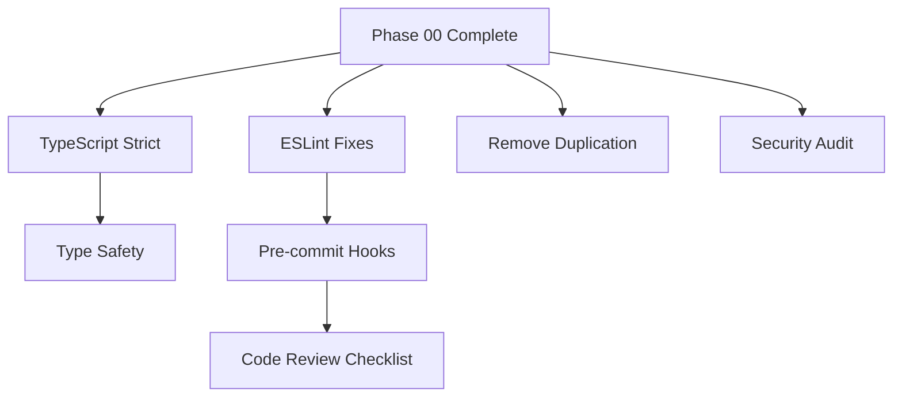

# Phase 01: Code Quality & Reliability (Week 4-5)

## 🎯 Phase Overview

**Goal:** Establish enterprise-grade code quality standards and eliminate technical debt before v1.0 release.

**Duration:** 1-2 weeks  
**Priority:** 🔴 CRITICAL  
**Status:** 🟡 Pending (starts after Phase 00)

---

## 📊 Success Criteria

- [ ] TypeScript strict mode enabled across all packages
- [ ] Zero ESLint errors in production code
- [ ] Pre-commit hooks configured (Husky + lint-staged)
- [ ] Code duplication eliminated (<5% duplication)
- [ ] All security vulnerabilities fixed
- [ ] Consistent code style enforced

---

## 📋 Task Breakdown

| Task ID | Title | Priority | Estimated Time | Status |
|---------|-------|----------|----------------|--------|
| QUAL-001 | Enable TypeScript Strict Mode | 🔴 High | 4-6 hours | ⬜ Not Started |
| QUAL-002 | Fix ESLint Errors and Warnings | 🔴 High | 3-4 hours | ⬜ Not Started |
| QUAL-003 | Set Up Pre-commit Hooks | 🟡 Medium | 2-3 hours | ⬜ Not Started |
| QUAL-004 | Eliminate Code Duplication | 🟡 Medium | 4-6 hours | ⬜ Not Started |
| QUAL-005 | Security Audit and Fixes | 🔴 High | 2-3 hours | ⬜ Not Started |
| QUAL-006 | Code Review Checklist | 🟢 Low | 1-2 hours | ⬜ Not Started |
| QUAL-007 | Type Safety Improvements | 🟡 Medium | 3-4 hours | ⬜ Not Started |

---

## 🔗 Dependencies

---

## 📈 Progress Tracking

**Overall Progress:** 0/7 tasks completed (0%)

### Week 4 Goals
- [ ] QUAL-001: TypeScript strict mode
- [ ] QUAL-002: ESLint fixes
- [ ] QUAL-005: Security audit

### Week 5 Goals
- [ ] QUAL-003: Pre-commit hooks
- [ ] QUAL-004: Code duplication
- [ ] QUAL-007: Type safety
- [ ] QUAL-006: Code review checklist

---

## 🚨 Blockers & Risks

| Risk | Impact | Mitigation |
|------|--------|------------|
| Strict mode breaks existing code | High | Enable package-by-package, fix incrementally |
| ESLint rules too strict | Medium | Adjust rules pragmatically, focus on real issues |
| Pre-commit hooks slow down workflow | Low | Optimize hook performance, cache results |

---

## 📝 Notes

- This phase builds on Phase 00 (Core Stabilization)
- Focus on automation over manual processes
- Quality gates should not block development
- All changes must maintain backward compatibility

---

**Created:** 2026-02-23  
**Last Updated:** 2026-02-23  
**Phase Owner:** AI Agent  
**Dependencies:** Phase 00 must be 100% complete
