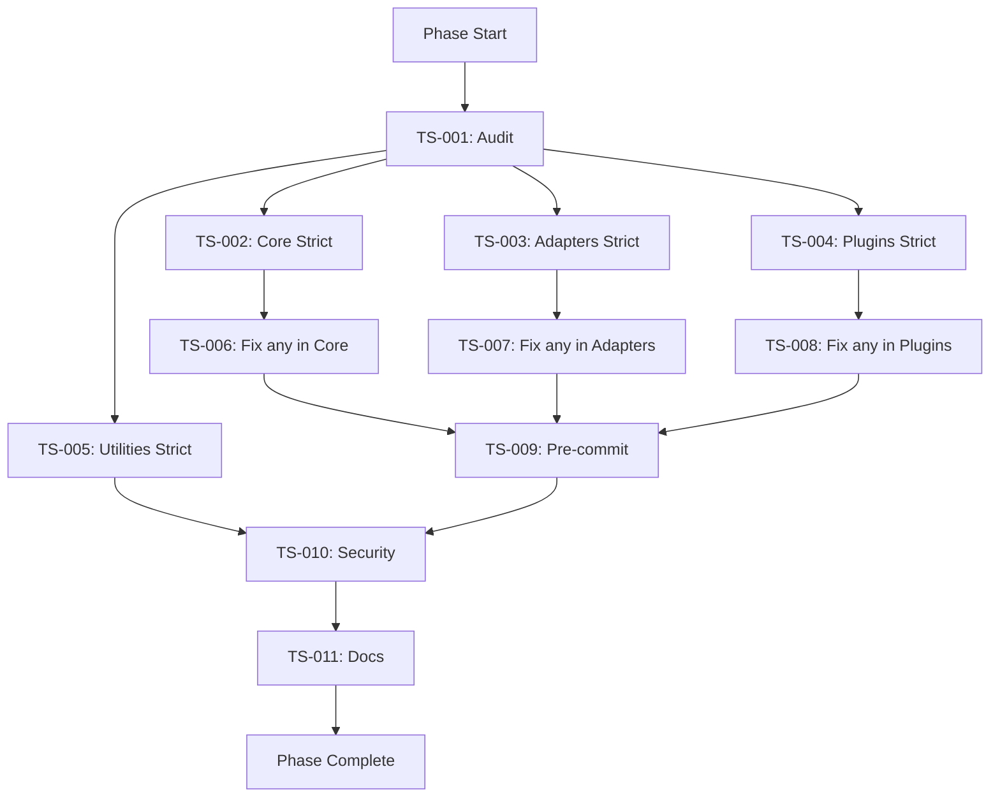

# Phase 01: Type Safety & Code Quality (2 Weeks)

## 🎯 Phase Overview

**Goal:** Eliminate all `any` types, enable TypeScript strict mode, and establish enterprise-grade code quality standards before v1.0 release.

**Duration:** 2 weeks (10 working days)
**Priority:** 🔴 CRITICAL - Blocks v1.0 release
**Status:** 🟡 Pending (starts after Phase 00)

---

## 📊 Success Criteria

### Must Have (Blocking v1.0)
- [ ] TypeScript strict mode enabled in ALL 12 packages
- [ ] Zero `any` types in production code (<10 exceptions with justification)
- [ ] Zero ESLint errors
- [ ] Zero ESLint warnings (or <20 with eslint-disable justification)
- [ ] All packages build successfully
- [ ] All tests passing (100% pass rate)
- [ ] Pre-commit hooks configured and working
- [ ] Zero high/critical security vulnerabilities

### Quality Metrics
| Metric | Current | Target |
|--------|---------|--------|
| **TypeScript Strict Mode** | ✅ 10/12 packages | 12/12 packages |
| **`any` types in code** | ~200+ | <10 |
| **ESLint Errors** | ✅ 0 | 0 |
| **ESLint Warnings** | ~550 | <20 |
| **Test Coverage** | Existing | Not decreased |
| **Build Time** | Existing | Not increased >10% |

---

## 📋 Task Breakdown

### Week 1: TypeScript Strict Mode (Days 1-5)

| Task ID | Title | Priority | Est. Time | Status |
|---------|-------|----------|-----------|--------|
| [TS-001](tasks/TS-001-audit-any-types.md) | Audit All `any` Types | 🔴 High | 2-3h | ⬜ |
| [TS-002](tasks/TS-002-core-strict-mode.md) | Enable Strict Mode: @nexus-state/core | 🔴 High | 4-6h | ⬜ |
| [TS-003](tasks/TS-003-adapters-strict-mode.md) | Enable Strict Mode: Adapters (react/vue/svelte) | 🔴 High | 4-6h | ⬜ |
| [TS-004](tasks/TS-004-plugins-strict-mode.md) | Enable Strict Mode: Plugins (persist/middleware/immer) | 🔴 High | 3-4h | ⬜ |
| [TS-005](tasks/TS-005-utilities-strict-mode.md) | Enable Strict Mode: Utilities (family/async/devtools/web-worker/cli) | 🔴 High | 3-4h | ⬜ |

### Week 2: Eliminate `any` & Automation (Days 6-10)

| Task ID | Title | Priority | Est. Time | Status |
|---------|-------|----------|-----------|--------|
| [TS-006](tasks/TS-006-fix-any-core.md) | Eliminate `any` in @nexus-state/core | 🔴 High | 6-8h | ⬜ |
| [TS-007](tasks/TS-007-fix-any-adapters.md) | Eliminate `any` in Adapters | 🔴 High | 4-6h | ⬜ |
| [TS-008](tasks/TS-008-fix-any-plugins.md) | Eliminate `any` in Plugins & Utilities | 🔴 High | 4-6h | ⬜ |
| [TS-009](tasks/TS-009-precommit-hooks.md) | Configure Pre-commit Hooks | 🟡 Medium | 2-3h | ⬜ |
| [TS-010](tasks/TS-010-security-audit.md) | Security Audit & Fixes | 🔴 High | 2-3h | ⬜ |
| [TS-011](tasks/TS-011-documentation.md) | Update Documentation | 🟢 Low | 1-2h | ⬜ |

---

## 🔗 Task Dependencies



---

## 📝 Execution Schedule

### Week 1: TypeScript Strict Mode

```
Day 1: TS-001 (Audit) + TS-002 (Core strict mode)
       - Run grep for all 'any' types
       - Create baseline report
       - Enable strict mode in core package
       - Fix compilation errors

Day 2: TS-003 (Adapters strict mode)
       - Enable strict mode in react/vue/svelte
       - Fix type errors in adapters
       - Verify builds

Day 3: TS-004 (Plugins strict mode)
       - Enable strict mode in persist/middleware/immer
       - Fix type errors
       - Run tests

Day 4: TS-005 (Utilities strict mode)
       - Enable strict mode in family/async/devtools/web-worker/cli
       - Fix remaining type errors
       - Verify all packages build

Day 5: Buffer + Testing
       - Catch up if behind
       - Run full test suite
       - Verify no regressions
```

### Week 2: Eliminate `any` & Automation

```
Day 6-7: TS-006 (Fix any in Core)
         - Replace all 'any' with proper types
         - Use 'unknown' where type is truly unknown
         - Add type guards
         - Update tests if needed

Day 8: TS-007 + TS-008 (Fix any in Adapters & Plugins)
       - Replace 'any' in remaining packages
       - Focus on public APIs first
       - Document any remaining exceptions

Day 9: TS-009 + TS-010 (Pre-commit + Security)
       - Configure Husky + lint-staged
       - Run npm audit
       - Fix vulnerabilities

Day 10: TS-011 + Phase Wrap-up
        - Update documentation
        - Create migration guide if needed
        - Phase retrospective
        - Prepare for Phase 02
```

---

## 🚨 Risks & Mitigations

| Risk | Impact | Probability | Mitigation |
|------|--------|-------------|------------|
| Breaking changes in public API | High | Medium | Document in CHANGELOG, add migration guide |
| Tests fail after type changes | Medium | Medium | Fix tests immediately, don't commit broken tests |
| Takes longer than estimated | Medium | High | Focus on production code first, tests second |
| `any` types in complex generics | High | Medium | Use `unknown` + type guards, document edge cases |

---

## 📊 Quality Standards

### Code Quality Requirements

**ALL tasks must follow:**

1. **No `any` types** (use `unknown` + type guards)
2. **SOLID principles** (especially Single Responsibility)
3. **Explicit return types** on all functions
4. **Type-safe generics** with proper constraints
5. **Null safety** (strictNullChecks enforced)
6. **No eslint-disable** without written justification

### Commit Message Format

```
<type>(<scope>): <subject>

<body: optional>

<footer: references>
```

**Types:** `feat`, `fix`, `refactor`, `test`, `docs`, `chore`, `build`

**Example:**
```
fix(types): eliminate any types in core/src/store.ts

- Replace 'any' with 'unknown' in getState()
- Add type guard for atom type checking
- Add explicit return types to all functions
- Update tests with proper type assertions

Resolves: TS-006
```

### Code Review Checklist

- [ ] No `any` types (or documented exception)
- [ ] All functions have explicit return types
- [ ] Generics have proper constraints
- [ ] Null/undefined handled safely
- [ ] Tests updated and passing
- [ ] ESLint passes (0 errors, 0 warnings)
- [ ] Build passes
- [ ] Commit message follows convention

---

## 🧪 Validation Commands

```bash
# 1. Check TypeScript strict mode in all packages
find packages -name "tsconfig.json" -exec grep -l '"strict": true' {} \; | wc -l
# Expected: 12

# 2. Count remaining 'any' types
grep -r ": any" packages/*/src --include="*.ts" | grep -v "node_modules" | grep -v test | wc -l
# Expected: <10

# 3. Run ESLint
npm run lint
# Expected: 0 errors, <20 warnings

# 4. Build all packages
npm run build
# Expected: Success

# 5. Run all tests
npm run test
# Expected: 100% pass

# 6. Security audit
npm audit
# Expected: 0 vulnerabilities
```

---

## 📚 Resources

### Documentation
- [TypeScript Strict Mode](https://www.typescriptlang.org/tsconfig#strict)
- [Unknown vs Any](https://www.typescriptlang.org/docs/handbook/release-notes/typescript-3-0.html#new-unknown-top-type)
- [Type Guards](https://www.typescriptlang.org/docs/handbook/advanced-types.html#type-guards-and-differentiating-types)

### Tools
- **TypeScript:** Type checking
- **ESLint:** Code linting
- **Husky:** Git hooks
- **lint-staged:** Staged file linting
- **npm audit:** Security scanning

---

## ✅ Phase Completion Checklist

When all tasks complete, verify:

- [ ] All 11 tasks marked as ✅ Done
- [ ] All acceptance criteria met
- [ ] All tests passing (100%)
- [ ] All builds successful
- [ ] 12/12 packages with strict mode
- [ ] <10 `any` types remaining
- [ ] 0 ESLint errors
- [ ] Pre-commit hooks working
- [ ] Security audit clean
- [ ] Documentation updated
- [ ] Phase retrospective completed
- [ ] Phase 02 planned

---

**Phase Created:** 2026-02-23
**Phase Owner:** AI Agent Team
**Target Start:** 2026-03-01
**Target Completion:** 2026-03-14 (2 weeks)

---

> 💡 **Note:** Each task is designed to be completed by an AI agent in a single session without losing context. Tasks include all necessary information, examples, and validation steps.
